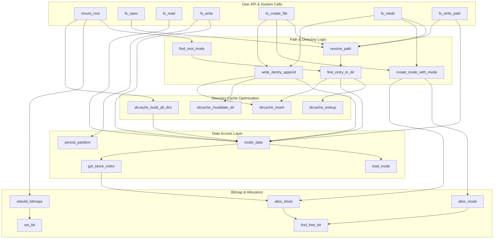
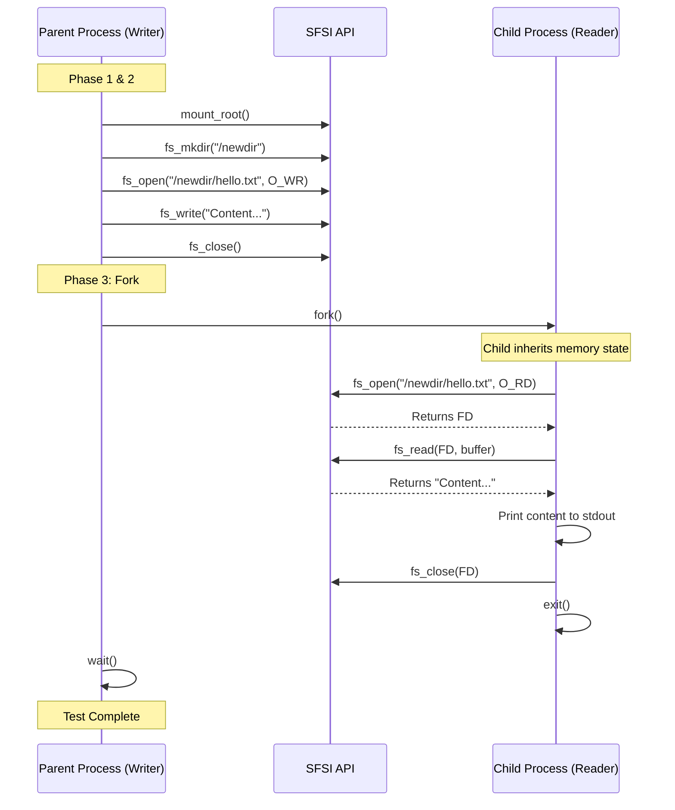

# Project 3: Simple File System Implementation (SFSI)

## Overview
This programm implements a compact inode-based Simple File System (SFS) that operates on a virtual disk image.
It demonstrates mounting the image, inode and block management, directory caching for fast lookups, file and directory creation, read/write operations, persistence back to the image, and a child process that simulates user activity (random file reads).

### Key Features
* **Virtual Disk Image:** all file-system state (inodes, blocks, data) lives in `disk.img`.
* **Inode-Based Architecture:** files and directories are represented by inodes with direct and indirect block pointers.
* **Directory Caching:** an in-memory hash-based cache speeds up directory lookups.
* **Indirect Addressing:** a single indirect block extends file capacity beyond direct blocks.
* **Persistence:** changes are written back to `disk.img` using `persist_partition`.
* **Child Process Simulation:** a forked child performs randomized file-open/read actions to simulate users.
* **Write Operations:** writing supported via open file descriptors (`fs_write`) and path-based truncate-and-write (`fs_write_path`).
---

## Disk Layout (summary and sizes)

- Block size: 1024 bytes (BLOCK_SIZE = 0x400).
- Overall partition target size: ~4 MB.

Logical layout:
- Superblock: 1 KB (super_block, padded to 1024 bytes)
- Inode table: 224 inodes × 32 bytes = 7,168 bytes (≈ 7 KB)
- Data blocks: 4,088 blocks × 1 KB = 4,088 KB (≈ 3.993 MB)
- Total ≈ 1 KB + 7 KB + 4,088 KB ≈ 4,096 KB = 4 MB

Notes:
- `num_inodes` is 224; each inode has six direct block pointers plus one single indirect block pointer (index stored in `indirect_block`).
- `data_blocks` array length is 4088 which provides the bulk of the storage area.
- `first_data_block` field in the superblock indicates where data blocks start (useful for on-disk addressing).
- The dentry structure supports filenames up to 255 bytes (plus NUL suggested by code that often ensures null-termination using `name_len`).

---

## Core Data Structures

- struct partition
  - Holds the entire on-disk partition layout: superblock, inode table, data blocks.

- struct inode
  - Fields: `mode`, `size`, `date`, `blocks[6]` (direct), `indirect_block` (single indirect), etc.
  - `mode` encodes type (directory vs regular) and permission bits.

- struct dentry
  - On-disk directory entry containing `inode`, `dir_length`, `name_len`, `name`, `file_type`.

- struct file_desc
  - In-process open file descriptor: `fd`, `inum`, `inode *`, `offset`, `flags`.
  - Managed by `fd_table[MAX_OPEN_FILES]`.

- Directory cache:
  - `struct dir_cache` contains `DCACHE_BUCKETS` hash buckets.
  - `struct dir_cache_entry` links a filename to its inode number.

- Bitmaps:
  - `inode_mapping[]` and `block_mapping[]` are in-memory bitmaps rebuilt from partition data.

---

## Main Functional Areas & Representative Functions

### Mounting & Initialization
- `mount_root(struct partition *part, unsigned char inode_mapping[], unsigned char block_mapping[], int *root_idx)`
  - Reads `disk.img` into the in-memory partition structure.
  - Verifies partition type, rebuilds inode/block bitmaps via `rebuild_bitmaps`.
  - Builds directory caches (`dircache_build_all_dirs`) and finds root inode (`find_root_inode`).

- `rebuild_bitmaps(struct partition *p, unsigned char *inode_map, unsigned char *block_map)`
  - Walks inodes and their blocks (direct + indirect) to reconstruct allocation bitmaps.

### Bitmap Helpers
- `set_bit`, `test_bit`, `find_free_bit`
  - Basic bitmap operations used by allocators.

### Block & Inode Allocation
- `alloc_block(struct partition *p, unsigned char *block_bitmap)`
  - Finds a free data block, clears it, marks it used.
- `alloc_inode(struct partition *p, unsigned char *inode_bitmap)`
  - Finds a free inode, zeroes the inode struct, initializes `indirect_block = -1`.

### Inode Data Access (read/write)
- `inode_data(struct partition *p, int inum, void *buf, unsigned int size, unsigned int offset, int write)`
  - Central function for reading/writing file or directory data.
  - Uses `get_block_index` to translate logical block indexes to physical blocks, allocating blocks when `write` is true.

- `get_block_index(struct partition *p, unsigned char *block_mapping, struct inode *node, int logical_blk, int alloc)`
  - Handles direct blocks (0..5) and single indirect block allocation and indexing.

### Directory Handling & Lookup
- `find_entry_in_dir(struct partition *p, int dir_inum, const char *name)`
  - Looks up a name inside a directory inode.
  - First checks directory cache (via `dircache_lookup`), falls back to linear scan with `inode_data`.
  - Inserts found entries into cache (`dircache_insert`).

- `dircache_*` functions:
  - `dircache_get_or_create`, `dircache_insert`, `dircache_lookup`, `dircache_build_for_dir`, `dircache_build_all_dirs`, `dircache_invalidate_dir`, `dircache_free_dir`, `dircache_free_all`
  - Implements a djb2-based string hash and simple chaining for collisions.

- `resolve_path(struct partition *part, const char *path, int *parent_out, int *leaf_out)`
  - Resolves a pathname from the `root_inode`, handling `.`, `..`, and missing interior elements.
  - Returns 1 for success (leaf found), 0 if final element missing (parent returned), -1 on error.

### Directory Listing & Formatting
- `ls_root(struct partition *p)`
  - Finds root inode and prints entries with permissions, size, date, and name.
- `ls_dir(const char *path)`
  - Lists contents of an arbitrary directory path.

- `format_mode(unsigned int mode, char *mode_str)`
  - Converts inode mode bits into `rwx` string (e.g., `drwxr-xr-x`).

### File Read & Write APIs
- `fs_open(const char *pathname, int flags)`
  - Opens an existing file by pathname, returning a small integer fd in `fd_table`.
  - Refuses to open directories for writing.

- `fs_read(int fd, void *buf, size_t count)`
  - Reads from open descriptor; uses `inode_data` and advances descriptor offset.

- `fs_write(int fd, const void *buf, size_t count)`
  - Writes to an open descriptor at current offset, updates inode `date`, and calls `persist_partition`.

- `fs_write_path(const char *pathname, const void *buf, size_t count)`
  - Path-based truncate and write: sets inode size to 0 then writes new content and persists.

- `fs_close(int fd)`
  - Frees the file descriptor.

### File & Directory Creation (on-disk)
- `create_inode_with_mode(struct partition *p, unsigned char *inode_map, unsigned char *block_map, int mode, int parent_inum)`
  - Allocates an inode and, for directories, allocates initial block and writes `.` and `..` entries.

- `write_dentry_append(struct partition *p, int parent_inum, const char *name, int child_inum)`
  - Appends a `struct dentry` to a directory inode (via `inode_data`).

- `fs_create_file(const char *pathname, const char *initial_content)`
  - Creates a regular file inode, appends a dentry to parent, optionally writes initial content, updates dircache, then persists.

- `fs_mkdir(const char *pathname)`
  - Creates a directory inode (with `.` and `..`), appends parent dentry, updates dircache, persists.

### Persistence
- `persist_partition(struct partition *p)`
  - Writes the entire in-memory `struct partition` back to `disk.img` (open `r+b`, write, flush, close).

### Utilities
- `collect_root_filenames(char ***out_names)`
  - Gathers regular filenames from the root directory for use by the child worker.



---

## Simulation of User Activity
- `child_work()`
  - Collects a list of regular files from root, shuffles them, and opens up to 10 files.
  - For each selected file:
    - Calls `fs_open(name, O_RD)`, repeatedly `fs_read` in `READ_CHUNK` increments, prints a small fragment (up to 256 bytes) from the start, and reports bytes read.
  - This routine runs in a forked child process in `main()` so it does not disturb parent process state.

---

## Current Sequence in main()
1. Allocate partition structure and `mount_root` (rebuild bitmaps and dir caches).
2. Demonstrate creating a directory `/newdir` with `fs_mkdir`.
3. Demonstrate creating `/newdir/hello.txt` using `fs_create_file` with initial content.
4. Open `/newdir/hello.txt` for read+write using `fs_open` and append via `fs_write`.
5. Demonstrate path-based replace with `fs_write_path("/file_45", ...)`.
6. List root directory using `ls_root`, list `/newdir` using `ls_dir`, and `cat_file` (print) selected files.
7. Fork a child: the child runs `child_work` to open and read files randomly. Parent waits, then continues cleanup.
8. Free directory caches and partition memory and exit.


---

## Notes, Limitations & Implementation Details

- In-memory bitmaps (`inode_mapping`, `block_mapping`) are rebuilt from on-disk partition data at mount time. They are used for allocation helpers but are not written as separate bitmap structures to disk — instead the partition image is persisted as a whole.
- The implementation supports only a single-level single indirect block (no double-indirect was implemented).
- Directory entries use a fixed `struct dentry` size; `dir_length` is set to `sizeof(struct dentry)` for appended entries.
- The directory cache is limited (MAX_INODES_CACHE, DCACHE_BUCKETS) and can be invalidated on directory updates.
- Error handling prints messages and generally returns `-1` on failure for callers to detect.
- The code calls `persist_partition` after mutating operations (file write, create, mkdir) to keep `disk.img` in sync.

---

## How to Use / Build
- Compile with your usual C toolchain (the program includes `"fs.h"`; ensure header and any compilation flags provide `BLOCK_SIZE`, inode definitions and partition struct).
- Ensure `disk.img` exists in same directory as compiled programm and matches the expected partition layout defined in `fs.h` (Or you can create one with DiskCreationTool).
- Run the binary; it will mount `disk.img`, perform demo creates/writes/list/cat, and spawn a child to read files.

---

# DiskCreationTool (Extra Implementation)

## 1. Overview
The **DiskCreationTool** is a C utility designed to generate a raw disk image file (`disk.img`) formatted with a custom, lightweight file system. The tool initializes the partition structure in memory, populates the file system metadata (Superblock, Inodes), creates a root directory, and populates it with randomly generated files before flushing the entire structure to a binary file.

## 2. File System Architecture (`fs.h`)
The file system is defined by a fixed-size partition structure containing a Superblock, an Inode Table, and a Data Block region.

### 2.1 Disk Layout
The physical partition is represented by the `struct partition`, which imposes a strict layout on the disk image.

| Region | Size | Description |
| :--- | :--- | :--- |
| **Superblock** | 1024 Bytes | Contains global filesystem metadata (volume name, counts, sizes). |
| **Inode Table** | 7168 Bytes | A fixed array of **224** inodes (32 bytes each) ($32 \times 224$). |
| **Data Blocks** | ~4 MB | An array of **4088** blocks, each 1024 bytes in size. |

### 2.2 Key Specifications
* **Magic Number:** `0x1111` (Identifies the partition type).
* **Block Size:** $1024$ bytes (`0x400`).
* **Max Files (Inodes):** 224.
* **Max Storage Blocks:** 4088.

### 2.3 Data Structures

#### **Superblock** (`struct super_block`)
Occupies the first 1024 bytes of the partition. It tracks the state of the filesystem, including:
* `partition_type`: Magic number validation.
* `block_size` & `inode_size`: Geometry definitions.
* `num_free_inodes` & `num_free_blocks`: Usage tracking.
* `volume_name`: 24-byte volume label (set to "FIXED_DISK" in `DiskCreationTool.c`).

#### **Inode** (`struct inode`)
A 32-byte structure representing a file or directory.
* **Addressing Scheme:**
    * **Direct:** `blocks[6]` array storing the first 6 data block indices.
    * **Indirect:** `indirect_block` points to a data block containing up to 512 additional block indices (block size 1024 / 2 bytes per short).
* **Metadata:** Stores file mode (permissions/type), size, write-lock status, and creation date.

#### **Directory Entry** (`struct dentry`)
Directories are special files containing a list of `dentry` structures.
* **Size:** ~272 bytes (Fixed name buffer of 256 bytes + metadata).
* **Fields:** Inode number, directory record length, file type, and filename.

---

## 3. Implementation Logic (`DiskCreationTool.c`)

The tool operates in a single pass, constructing the filesystem in RAM (`malloc` of `struct partition`) and writing the result to disk.

### 3.1 Initialization
1.  **Memory Allocation:** Allocates the full partition structure.
2.  **Bitmap Setup:** Initializes in-memory bitmaps (`inode_bitmap`, `block_bitmap`) to track allocations.
3.  **Superblock Setup:** Sets the magic number, block counts, and volume name.
4.  **Reservation:** Reserves Block 0 and Inode 0 (marking them as used in bitmaps).

### 3.2 Core Algorithms

* **Allocation (`alloc_inode`, `alloc_block`)**:
    Performs a linear search on the respective bitmap to find the first free index, marks it as used, and updates the superblock counters.

* **File Writing (`write_to_file`)**:
    Writes data buffer to a specific inode. It handles the logic of switching between direct and indirect addressing:
    1.  Calculates the logical block index based on the write offset.
    2.  If the logical index $< 6$, it uses `node->blocks[]`.
    3.  If the logical index $\ge 6$, it allocates an indirect block (if null) and looks up/allocates the physical block within that indirect block.

* **Directory Management (`add_entry_to_dir`)**:
    Appends a `dentry` to a directory's data.
    * **Padding Logic:** Before writing a new entry, it checks if the remaining space in the current block is sufficient. If not ($< \text{sizeof(dentry)}$), it fills the remainder with padding to ensure directory entries do not cross block boundaries.

### 3.3 Main Execution Flow
1.  **Root Creation:** Allocates Inode 1 for the root directory and adds standard `.` and `..` entries.
2.  **Content Generation:** Loops 10 times to create random files:
    * Allocates a new inode.
    * Generates random text content using a "Lorem Ipsum" source.
    * Writes content to the file.
    * Updates the root directory with the new file's name (`file_0`, `file_1`, etc.).
3.  **Image Flush:** Opens `disk.img` and writes the entire `struct partition` memory block to the file.

---

## 4. Usage

To build and run the tool, use the GCC compiler:

```bash
# Compile the tool
gcc -o DiskCreationTool DiskCreationTool.c

# Run the tool to generate disk.img
./DiskCreationTool

